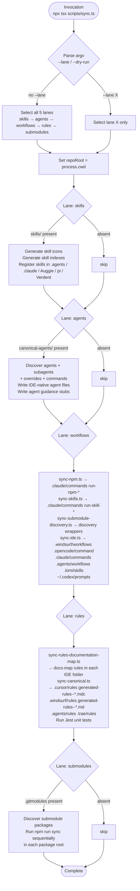

# ide-sync
A portable IDE sync toolchain, packaged as a Claude Agent Skill. It projects canonical agent-facing sources (skills, agents, workflows, rules, and submodule sync targets) from a host repository into the IDE-native surfaces consumed by Claude Code, Cursor, Windsurf, OpenCode, Kimi, and friends. The skill ships as a real Node package: a host repository wires its own `npm run sync` (and the `sync:*` lanes) to the orchestrator at `scripts/sync.ts`, and the host stays unaware of the skill's internal layout.

The orchestrator is lane-based — `skills`, `agents`, `workflows`, `rules`, and `submodules` each have their own renderer set under `scripts/`. `process.cwd()` is the contract: the target repository is always the current working directory, never inferred from the skill's own install location.

## Install

The fastest cross-agent install path is the `skills` CLI:

```bash
npx skills add gg-skills/ide-sync
```

Drop this skill into a workspace as a Git submodule for pinned versions, or as a plain clone for latest `main`:

```bash
# Project-local, version-pinned:
git submodule add git@github.com:gg-skills/ide-sync.git .claude/skills/ide-sync

# OR project-local, latest main:
mkdir -p .claude/skills
git -C .claude/skills clone git@github.com:gg-skills/ide-sync.git

# OR user-level, available in every project on this machine:
mkdir -p ~/.claude/skills
git -C ~/.claude/skills clone git@github.com:gg-skills/ide-sync.git
```

Restart your agent or reload skills after installation. See the parent [`skills` catalog repo](https://github.com/gg-skills/skills) for the full catalog.

## When to use

- Wiring a repository's `sync`, `skills:sync`, `agents:sync`, `workflows:sync`, `rules:sync`, or package-submodule sync commands to this portable toolchain.
- Running or debugging IDE projection output for skills, agents, workflow commands, rule files, or generated documentation-map rules.
- Moving repository-local IDE sync entrypoints into this skill-owned script surface.
- Adding a new IDE target (a new `.<editor>/` projection) to the shared sync behavior.

Skip it when you only need to author a skill's `SKILL.md` content without touching generated IDE surfaces, when a package has its own specialized sync that nobody has asked to replace, or when you actually want browser/runtime validation rather than projection.

## How it operates

### Inputs

The orchestrator reads exclusively from `process.cwd()` (the target repository root). It expects zero, some, or all of these source families to exist:

| Source family | Expected path (relative to repo root) | Consumed by lane |
|---|---|---|
| Canonical skills | `skills/` | `skills` |
| Canonical agents | `canonical-agents/primary-agents/`, `canonical-agents/subagents/`, `canonical-agents/overrides/`, `canonical-agents/commands/` | `agents` |
| Agent guidance files | root guidance markdown | `agents` |
| Canonical workflows | `canonical-workflows/wf-*.md`, `package.json` scripts | `workflows` |
| Canonical rules | `canonical-rules/*.md` | `rules` |
| Documentation sources | docs and guidance markdown in the repo | `rules` (docs-sync sub-lane) |
| Git submodule list | `.gitmodules` | `submodules` |

Lanes are capability-aware: a missing source family produces a "no source files" log line, not an error.

### Outputs

Each lane projects sources into IDE-native directories inside `process.cwd()` (and, for Codex CLI, into `~/.codex/prompts`):

| Lane | Written paths |
|---|---|
| `skills` | `canonical-agents/skills/` registration artifacts; skill icon files; skill index files |
| `agents` | `.agents/` (Antigravity), `.augment/commands/`, and other IDE-native agent definition files |
| `workflows` | `.windsurf/workflows/`, `.opencode/command/`, `.claude/commands/`, `.agents/workflows/`, `.kimi/skills/`, `~/.codex/prompts/` |
| `rules` | `.cursor/rules/generated-rules--*.mdc`, `.windsurf/rules/generated-rules--*.md`, `.agents/rules/generated-rules--*.md`, `.trae/rules/generated-rules--*.md` |
| `submodules` | Delegates to each submodule package's own `npm run sync`; no direct writes from this orchestrator |

All generated files carry a prefix (`generated-rules--`, `run-npm-`, `run-skill-`, `wf-`, etc.) that scopes ownership — the renderers delete stale prefixed files before rewriting, so manual edits in these directories are silently overwritten on the next sync.

### External commands

The orchestrator itself (`scripts/sync.ts`) is invoked via `tsx` and spawns child processes with `spawnSync` from the target repo root. From the host `package.json` the surface looks like:

```bash
# Full sync — every lane in order:
npx tsx .agents/skills/ide-sync/scripts/sync.ts

# Individual lanes:
npx tsx .agents/skills/ide-sync/scripts/sync.ts --lane skills
npx tsx .agents/skills/ide-sync/scripts/sync.ts --lane agents
npx tsx .agents/skills/ide-sync/scripts/sync.ts --lane workflows
npx tsx .agents/skills/ide-sync/scripts/sync.ts --lane rules
npx tsx .agents/skills/ide-sync/scripts/sync.ts --lane submodules
```

Each lane resolves to one or more `npx tsx <script>` child invocations (see [Lane responsibilities](#lane-responsibilities) in SKILL.md for the full per-lane command list). The `submodules` lane additionally calls `npm run sync` inside each `.gitmodules`-listed package.

From inside the skill's own checkout the same entrypoints are aliased in `package.json`:

```bash
npm run sync           # full sync
npm run sync:skills
npm run sync:agents
npm run sync:workflows
npm run sync:rules
npm run sync:submodules
npm test               # Jest unit tests for renderers
npm run typecheck      # tsc --noEmit
```

### Side effects

- **Filesystem writes** to the IDE-specific paths listed in Outputs. Directories are created automatically; existing generated files with matching prefixes are replaced.
- **Codex CLI writes** go to `~/.codex/prompts` (a global user path, not the repo) or the path in `$CODEX_PROMPTS_DIR`.
- **Submodule package syncs**: the `submodules` lane discovers packages via `.gitmodules` and runs `npm run sync` sequentially in each package root — those packages own their own downstream writes.
- **No network calls**: the toolchain is purely local filesystem I/O.

### Mode toggles

| Flag | Lanes that honour it | Effect |
|---|---|---|
| `--lane <name>` | all | Restricts execution to the named lane(s). Omit to run all five in order. |
| `--dry-run` / `--check` | `agents`, `workflows`, `rules`, `submodules` | Reports planned changes without writing. The `skills` lane is intentionally write-only. |
| `SYNC_VERBOSE=1` or `WORKFLOWS_SYNC_VERBOSE=1` | all | Enables per-file confirmation lines in stdout. Off by default. |

Example — preview workflow changes without writing:

```bash
npx tsx .agents/skills/ide-sync/scripts/sync.ts --lane workflows --dry-run
```

## Operational flow



## Layout

```
.
├── SKILL.md                ← entry point, with YAML frontmatter
├── package.json            ← Node project manifest (sync / sync:* / test / typecheck)
├── tsconfig.json           ← TypeScript config for the script surface
├── jest.config.ts          ← skill-local Jest config for lane unit tests
├── agents/                 ← generated agent metadata for IDE surfaces
├── assets/                 ← skill icons
├── references/             ← quick-reference docs the skill loads on demand
└── scripts/                ← the actual sync toolchain
    ├── sync.ts                       ← lane orchestrator (entry point)
    ├── __tests__/                    ← unit tests for renderers
    ├── skill-index/                  ← skill icon + root skill-index generation
    ├── canonical-agents/             ← canonical agent projection + skill registration
    ├── agents-guidance/              ← agent guidance file projection
    ├── canonical-workflows/          ← NPM / skill / package / manual workflow projection
    ├── canonical-rules/              ← canonical IDE rule projection
    ├── docs-sync/                    ← generated documentation-map rules
    └── platform/                     ← submodule sync support
```

`package.json`, `tsconfig.json`, and `jest.config.ts` sit at the skill root on purpose — the skill is a real installable Node package, not just guidance.

## Quick start

This skill is meant to be invoked from a **target repository's** root (the project whose `canonical-*` folders you want to project). The orchestrator is `tsx`-driven, so the only prerequisite is having `tsx` available in the target repo.

Run lanes directly:

```bash
# Full sync — every available lane, in order.
npx tsx .agents/skills/ide-sync/scripts/sync.ts

# Individual lanes (skip the ones whose canonical source is absent).
npx tsx .agents/skills/ide-sync/scripts/sync.ts --lane skills
npx tsx .agents/skills/ide-sync/scripts/sync.ts --lane agents
npx tsx .agents/skills/ide-sync/scripts/sync.ts --lane workflows
npx tsx .agents/skills/ide-sync/scripts/sync.ts --lane rules
npx tsx .agents/skills/ide-sync/scripts/sync.ts --lane submodules

# Dry-run is supported by some lanes (notably workflows).
npx tsx .agents/skills/ide-sync/scripts/sync.ts --lane workflows --dry-run
```

Recommended wiring in the **host** `package.json` (mirroring the lane names this skill itself exposes):

```json
{
  "scripts": {
    "sync": "npx tsx .agents/skills/ide-sync/scripts/sync.ts",
    "sync:skills": "npx tsx .agents/skills/ide-sync/scripts/sync.ts --lane skills",
    "sync:agents": "npx tsx .agents/skills/ide-sync/scripts/sync.ts --lane agents",
    "sync:workflows": "npx tsx .agents/skills/ide-sync/scripts/sync.ts --lane workflows",
    "sync:rules": "npx tsx .agents/skills/ide-sync/scripts/sync.ts --lane rules",
    "sync:submodules": "npx tsx .agents/skills/ide-sync/scripts/sync.ts --lane submodules"
  }
}
```

The skill itself uses the same names internally — from inside this skill's checkout you can run the bundled aliases:

```bash
npm run sync
npm run sync:skills
npm run sync:agents
npm run sync:workflows
npm run sync:rules
npm run sync:submodules

# Unit tests for renderers.
npm test

# Type-check the script surface.
npm run typecheck
```

## Resources

- [`SKILL.md`](./SKILL.md) — full operating guidance, lane responsibilities, troubleshooting matrix.
- [`references/quick-reference.md`](./references/quick-reference.md) — concise command and adoption checklist.
- [`scripts/sync.ts`](./scripts/sync.ts) — lane orchestrator entry point.
- [`scripts/__tests__/`](./scripts/__tests__/) — unit-test coverage for lane renderers.
- [`agents/openai.yaml`](./agents/openai.yaml) — generated agent metadata for IDE surfaces.

## Caveats

- **CWD is the contract.** Lanes write into `process.cwd()`. If you run from inside `skills/ide-sync/`, the lanes will dutifully write into the skill folder. `cd` to the target repo root first.
- **Lanes are capability-aware, not mandatory.** Not every repo has every `canonical-*` source family. A lane reporting "no source files" is information, not an error — skip it or add the missing source intentionally.
- **Generated output is a projection.** `.claude/`, `.agents/`, `.windsurf/`, `.opencode/`, `.kimi/`, `.cursor/`, `.ide-rules/` and the like are downstream of canonical sources and renderer logic. Editing them by hand will be silently overwritten on the next sync — patch the canonical source or the renderer instead.
- **Dry-run support is not universal.** Some skill-index work is intentionally write-oriented. Check the lane's behavior before assuming `--dry-run` is a no-op.
- **Order matters for full syncs.** When running lanes by hand: skills → agents → workflows → rules → submodules. The orchestrator does this automatically; the manual sequence is for partial runs.
- **`sharp` is an optional peer dep.** Only the skill-index lane needs it (for icon generation). Other lanes work without it.
- **Codex CLI writes to a global path.** The `~/.codex/prompts` directory is outside the repo; override with `CODEX_PROMPTS_DIR` if needed.
